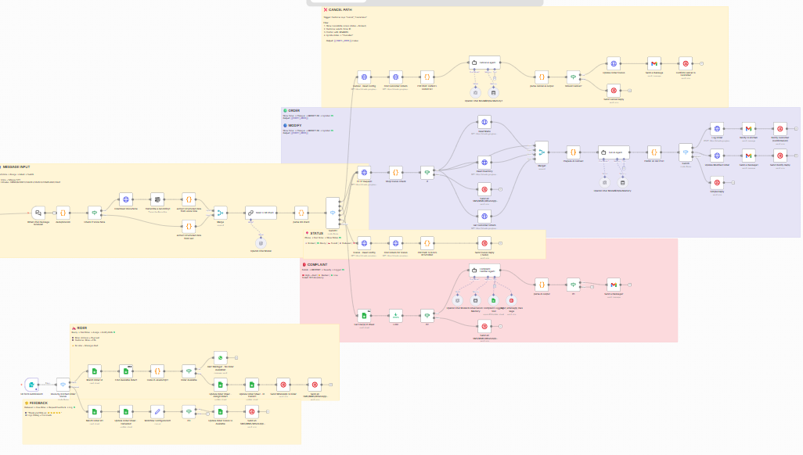

# AI-Powered Restaurant Order Automation Agent

For whatsapp:


For website:



## Technology Document


## 1. Project Scope & Deliverables (The "What")

### Project Name
**AI-Powered Restaurant Order and Logistics Agent** (RestoPulse AI)

### Problem Statement
Local restaurants face high operational costs, high error rates in phone orders, and difficulty managing peak-hour order volume. This AI-powered automation system streamlines operations, reduces human error, and significantly improves the customer experience. The solution delivers rapid ROI by automating the entire order cycle—from customer inquiry to delivery.

### Core Goal
To automate the entire customer order lifecycle including:
- **Smart Order Booking** (with Inventory Validation)
- **Order Modification & Cancellation**
- **Real-time Order Status Tracking**
- **Complaint Resolution & Escalation**
- **Automated Rider Dispatch**
- **Feedback Collection**

The system uses AI and automation tools, enabling seamless interaction via WhatsApp, with backend orchestration through n8n workflows.

### Target Users
| User Type | Interaction Method | Purpose |
|-----------|-------------------|---------|
| Restaurant Customers | WhatsApp (Text/Voice) | Place orders, modify, cancel, check status, complaints |
| Kitchen Staff | Email + Google Sheets | Order fulfillment, status updates |
| Riders | WhatsApp/SMS | Delivery assignments and instructions |
| Restaurant Manager | WhatsApp Alerts + Email | Escalations, alerts, daily reports |

### Tech Stack (Implemented)
| Component | Technology | Status |
|-----------|------------|--------|
| **Orchestration** | n8n (Deployed on AWS Server) | ✅ Deployed |
| **AI Logic** | OpenAI GPT-5 | ✅ Implemented |
| **Database** | Google Sheets (Menu, Inventory, Orders, Config, Riders, Complaints, Feedback) | ✅ Implemented |
| **Messaging** | Twilio WhatsApp API | ✅ Implemented |
| **Voice Processing** | OpenAI Whisper | ✅ Implemented |
| **Email Notifications** | Gmail API | ✅ Implemented |
| **Website Integration** | Embeddable Chat Widget (Any Restaurant Website) | ✅ Ready |

### 🌐 Multi-Channel Integration

The system supports **multiple input channels**, making it versatile for any restaurant:

```
┌─────────────────────────────────────────────────────────────────┐
│                    MULTI-CHANNEL INPUT                          │
├─────────────────────────────────────────────────────────────────┤
│                                                                  │
│   📱 WhatsApp          💻 Website Chat         🌐 Web API       │
│   (Twilio)             (Embeddable Widget)     (REST Endpoint)  │
│       │                      │                       │          │
│       └──────────────────────┼───────────────────────┘          │
│                              ▼                                   │
│                    ┌─────────────────┐                          │
│                    │  n8n WEBHOOK    │                          │
│                    │  (Unified Entry)│                          │
│                    └────────┬────────┘                          │
│                             ▼                                    │
│                    ┌─────────────────┐                          │
│                    │ WORKFLOW 1-4    │                          │
│                    │ (Same Logic)    │                          │
│                    └─────────────────┘                          │
│                                                                  │
└─────────────────────────────────────────────────────────────────┘
```

**Website Integration Features:**
- Embeddable chat widget for any restaurant website
- Same AI agent handles both WhatsApp and website orders
- Unified order management in Google Sheets
- No code changes required for different restaurants

---

## 2. Complete Project Workflow Architecture

The project consists of **4 interconnected workflows** orchestrated through n8n and powered by Google Sheets as the central database.

```
┌─────────────────────────────────────────────────────────────────────────────┐
│                         RESTOPULSE AI ARCHITECTURE                          │
├─────────────────────────────────────────────────────────────────────────────┤
│                                                                              │
│    📱 CUSTOMER (WhatsApp)                                                   │
│           │                                                                  │
│           ▼                                                                  │
│    ┌─────────────────────────────────────────────────────────────────┐      │
│    │                    TWILIO WEBHOOK                                │      │
│    │                 (Text + Voice Notes)                             │      │
│    └───────────────────────────┬─────────────────────────────────────┘      │
│                                │                                             │
│                                ▼                                             │
│    ┌─────────────────────────────────────────────────────────────────┐      │
│    │                   INTENT DETECTION (OpenAI)                      │      │
│    │         ORDER | MODIFY | CANCEL | STATUS | COMPLAINT | CHAT      │      │
│    └───────────────────────────┬─────────────────────────────────────┘      │
│                                │                                             │
│         ┌──────────────────────┼──────────────────────┐                     │
│         │                      │                      │                     │
│         ▼                      ▼                      ▼                     │
│  ┌──────────────┐    ┌──────────────┐      ┌──────────────┐                │
│  │ WORKFLOW 1   │    │ WORKFLOW 2   │      │ WORKFLOW 3   │                │
│  │ ORDER/MODIFY │    │  COMPLAINT   │      │    RIDER     │                │
│  │ CANCEL/STATUS│    │   SYSTEM     │      │  DISPATCH    │                │
│  └──────┬───────┘    └──────┬───────┘      └──────┬───────┘                │
│         │                   │                      │                        │
│         └───────────────────┼──────────────────────┘                        │
│                             │                                                │
│                             ▼                                                │
│                    ┌──────────────┐                                         │
│                    │ WORKFLOW 4   │                                         │
│                    │  FEEDBACK    │                                         │
│                    │ COLLECTION   │                                         │
│                    └──────────────┘                                         │
│                                                                              │
│    ┌─────────────────────────────────────────────────────────────────┐      │
│    │                    GOOGLE SHEETS DATABASE                        │      │
│    │   Menu | Inventory | Orders | Riders | Complaints | Feedback    │      │
│    └─────────────────────────────────────────────────────────────────┘      │
│                                                                              │
└─────────────────────────────────────────────────────────────────────────────┘
```

---

## 3. Workflow Details

### 3.1. 🟢 Workflow 1: ORDER / MODIFY / CANCEL / STATUS (The Chatbot Agent)

**Status: ✅ FULLY IMPLEMENTED**

#### Trigger
Incoming message from customer on WhatsApp (via Twilio Webhook) - supports both text and voice notes in Urdu and English.

#### Intent Handling

| Intent | Description | Implementation Status |
|--------|-------------|----------------------|
| **ORDER** | New order placement | ✅ Implemented |
| **MODIFY** | Change existing order | ✅ Implemented |
| **CANCEL** | Cancel existing order | ✅ Implemented |
| **STATUS** | Check order status | ✅ Implemented |
| **CHAT** | General inquiries | ✅ Implemented |

#### Step-by-Step Flow

```
┌────────────────────────────────────────────────────────────────────────┐
│                    WORKFLOW 1: ORDER LIFECYCLE                          │
└────────────────────────────────────────────────────────────────────────┘

[WhatsApp Message] → [Voice Note?]
                          │
         ┌────────────────┴────────────────┐
         ▼ YES                             ▼ NO
   [STT: Whisper API]                 [Text Direct]
         │                                  │
         └──────────────┬──────────────────┘
                        ▼
                [Shop Status Check]
                        │
         ┌──────────────┴──────────────┐
         ▼ CLOSED                      ▼ OPEN
   [Send Closed Msg]            [Intent Detection AI]
                                        │
              ┌───────────┬─────────────┼─────────────┬───────────┐
              ▼           ▼             ▼             ▼           ▼
           [ORDER]    [MODIFY]      [CANCEL]      [STATUS]     [CHAT]
              │           │             │             │           │
              ▼           ▼             ▼             ▼           ▼
        [AI Agent:   [AI Agent:   [AI Agent:   [Find Order]  [AI Reply]
         New Order]   Modify]      Cancel]          │
              │           │             │            ▼
              │           │             │      [Status Msg]
              ▼           ▼             ▼
        [Inventory Check & Validation]
              │
              ▼
        [Order Confirmed?]
              │
    ┌─────────┴─────────┐
    ▼ NO                ▼ YES
[Re-prompt]       [Log to Sheets]
                        │
              ┌─────────┴─────────┐
              ▼                   ▼
    [Customer WhatsApp]     [Kitchen Email]
    [Confirmation]          [Notification]
```

#### ORDER Flow Implementation

**Step 1: Input Processing**
- Voice notes processed via OpenAI Whisper (Twilio integration)
- Text messages passed directly
- Implemented in: `EXTRACT_MESSAGE_DATA_TWILIO.js`

**Step 2: Shop Status Validation**
- Reads `System_Config` for shop open/closed status
- Time-based validation
- If closed: Auto-reply "We are currently offline"
- Implemented in: `03_SHOP_STATUS_CHECK.js`

**Step 3: AI Agent & RAG**
- OpenAI GPT acts as polite virtual waiter (Urdu/English)
- Uses Google Sheets as RAG knowledge base (Menu, Prices, Timings)
- Entity extraction: Items, Quantity, Address, Phone, Payment Method
- Implemented in: `FULL-AI-AGENT-MERGED-PROMPT.md`

**Step 4: Inventory Validation**
- Real-time inventory check before order confirmation
- Status handling:
  - **Available**: Proceed with order
  - **Ingredients Finished**: Suggest alternative
  - **Kitchen Overload**: Warn about delay (15-20 min)
  - **Discontinued**: Suggest alternative

**Step 5: Order Logging**
- Creates new row in Orders sheet
- Auto-generated Order_ID (ORD-timestamp format)
- Status: "Booked"
- Implemented in: `06_PARSE_AI_OUTPUT.js`

**Step 6: Notifications**
- **Customer**: WhatsApp confirmation via Twilio
  ```
  "Your order is booked! Order #ORD-20251218123456. 
   Total: Rs. 1,250. Status: Booked. Thank you!"
  ```
- **Kitchen**: Email notification via Gmail with order details and Sheet link

#### MODIFY Flow Implementation

**Trigger**: Customer says "modify", "change", "add karo", etc.

**Steps**:
1. Show existing order(s) for customer
2. Present modification options:
   - Add new items
   - Remove items
   - Change address
   - Change payment method
3. Calculate new total (Original + New Items + Delivery)
4. Confirmation keyword: **MODIFY OK**
5. Update order in Google Sheets

Implemented in: `FULL-AI-AGENT-MERGED-PROMPT.md`

#### CANCEL Flow Implementation

**Trigger**: Customer says "cancel", "cancel karo", etc.

**Steps**:
1. Show cancellable orders (status = "Booked")
2. Customer selects Order ID
3. Confirmation keyword: **XCANCEL**
4. Update order status to "Cancelled"

Implemented in: `CANCEL-AI-AGENT-PROMPT.json`

#### STATUS Flow Implementation

**Trigger**: Customer asks "where is my order?", "order kahan hai", etc.

**Steps**:
1. Lookup orders by customer phone number
2. Return most recent order status with contextual message:
   - **Booked**: "Order received, preparing in 15-20 minutes"
   - **Ready**: "Order ready, rider being assigned"
   - **In Transit**: "On the way! Rider: [Name], Contact: [Number]"
   - **Delivered**: "Order delivered! Please share feedback"
   - **Cancelled**: "Order was cancelled"

Implemented in: `10_STATUS_FIND_ORDER.js`

---

### 3.2. 🔴 Workflow 2: COMPLAINT System

**Status: ✅ FULLY IMPLEMENTED**

#### Trigger
LLM detects COMPLAINT intent or negative sentiment keywords.

#### Flow Diagram

```
┌────────────────────────────────────────────────────────────────────────┐
│                    WORKFLOW 2: COMPLAINT HANDLING                       │
└────────────────────────────────────────────────────────────────────────┘

[COMPLAINT Intent Detected]
           │
           ▼
   [Complaint AI Agent]
           │
           ▼
   [Collect Information]
   • Receipt ID (or unknown)
   • Items with issue
   • Date of purchase
   • Time of purchase
   • Customer name
   • Issue description
           │
           ▼
   [Customer sends: XREPORT]
           │
           ▼
   [Determine Severity]
      │         │         │
      ▼         ▼         ▼
   [HIGH]    [MEDIUM]   [LOW]
      │         │         │
      │         └────┬────┘
      │              │
      ▼              ▼
[Manager Alert]  [Log Only]
[Urgent SMS]
      │              │
      └──────┬───────┘
             ▼
   [Log to Complaints Sheet]
   • Ticket_ID (TKT-timestamp)
   • Order_ID
   • Items
   • Date, Time
   • Customer_Name, Phone
   • Complaint Description
   • Severity
   • Status: Open
             │
             ▼
   [Send Acknowledgment]
   "Ticket #TKT-xxx registered.
    Manager will contact within 30 mins."
```

#### Implementation Details

**Severity Classification**:
| Severity | Keywords | Action |
|----------|----------|--------|
| **High** | lizard, insect, cockroach, food poisoning, sick, hospital, foreign object | Immediate manager alert |
| **Medium** | cold food, wrong item, missing items, late delivery, stale, raw | Log for daily review |
| **Low** | packaging, portion size, staff attitude, rude | Log for analysis |

**Confirmation Keyword**: **XREPORT**

Implemented in: 
- `COMPLAINT-AI-AGENT-PROMPT.json`
- `11_COMPLAINT_PARSE.js`

---

### 3.3. 🟡 Workflow 3: Rider Assignment & Logistics

**Status: ✅ FULLY IMPLEMENTED**

#### Trigger
Google Sheets trigger when Order Status changes from "**Booked**" → "**Ready**" (Kitchen staff update)

#### Flow Diagram

```
┌────────────────────────────────────────────────────────────────────────┐
│                    WORKFLOW 3: RIDER DISPATCH                           │
└────────────────────────────────────────────────────────────────────────┘

[Trigger: Status = "Ready"]
           │
           ▼
   [Query Rider Sheet]
   [Find Available Riders]
           │
    ┌──────┴──────┐
    ▼             ▼
[Rider Found]  [No Rider]
    │             │
    ▼             ▼
[Select Rider] [Alert Manager]
[By Priority]  [Manual Assignment]
    │
    ▼
[Update Rider Sheet]
• Status: "Assigned"
• Order_ID: linked
    │
    ▼
[Update Order Sheet]
• Status: "In Transit"
• Rider_Name
• Rider_Contact
    │
    ├─────────────────────┐
    ▼                     ▼
[Rider Notification]  [Customer Notification]
WhatsApp/SMS:         WhatsApp:
• Customer address    • "Order is with rider!"
• Customer contact    • Rider Name: [Name]
• Payment method      • Contact: [Number]
• Order details       • ETA: 20-30 mins
```

#### Rider Sheet Structure

| Column | Description |
|--------|-------------|
| Rider_ID | Unique identifier |
| Rider_Name | Display name |
| Phone | Contact number |
| Status | Available / Assigned / Off-Duty |
| Current_Order_ID | Linked order (if assigned) |
| Deliveries_Today | Count for prioritization |
| Last_Updated | Timestamp |

#### Rider Priority Logic
- Assign rider with **fewest deliveries today** (workload balancing)
- If equal, assign by availability timestamp (FIFO)

---

### 3.4. 🟣 Workflow 4: Order Closure & Feedback

**Status: ✅ FULLY IMPLEMENTED**

#### Trigger
Google Sheets trigger when Order Status changes from "**In Transit**" → "**Delivered**"

#### Flow Diagram

```
┌────────────────────────────────────────────────────────────────────────┐
│                    WORKFLOW 4: FEEDBACK COLLECTION                      │
└────────────────────────────────────────────────────────────────────────┘

[Trigger: Status = "Delivered"]
           │
           ▼
   [Update Rider Sheet]
   • Status: "Available"
   • Clear Order_ID
   • Increment Deliveries_Today
           │
           ▼
   [Send Feedback Request]
   WhatsApp/SMS to Customer:
   "Thank you for choosing us! 🙏
    Please share your feedback:
    [Feedback Link]"
           │
           ▼
   [Customer Submits Feedback]
           │
           ▼
   [Log to Feedback Sheet]
   • Order_ID
   • Customer_Phone
   • Rating (1-5)
   • Comments
   • Timestamp
```

#### Feedback Sheet Structure

| Column | Description |
|--------|-------------|
| Feedback_ID | Auto-generated |
| Order_ID | Linked order |
| Customer_Phone | For reference |
| Rating | 1-5 stars |
| Comments | Customer feedback text |
| Timestamp | Submission time |
| Resolved | TRUE/FALSE |

---

## 4. Google Sheets Database Structure

### Overview

| Sheet Tab | Purpose | Status |
|-----------|---------|--------|
| Menu | Item catalog with prices | ✅ Implemented |
| Inventory | Stock status per item | ✅ Implemented |
| Orders | All order transactions | ✅ Implemented |
| System_Config | Shop settings | ✅ Implemented |
| Riders | Rider management | ✅ Implemented |
| Complaints | Issue tracking | ✅ Implemented |
| Feedback | Customer reviews | ✅ Implemented |

### 4.1. Menu Sheet

| Column | Type | Example |
|--------|------|---------|
| Item_ID | String | ITEM001 |
| Item_Name | String | Chicken Zinger Burger |
| Category | String | Burgers |
| Price | Number | 450 |
| Description | String | Crispy chicken with special sauce |
| Available | Boolean | TRUE |

### 4.2. Inventory Sheet

| Column | Type | Example |
|--------|------|---------|
| Item_ID | String | ITEM001 |
| Item_Name | String | Chicken Zinger Burger |
| Status | String | Available / Ingredients Finished / Kitchen Overload / Discontinued |
| Stock_Level | Number | 25 |
| Alternative_Item_ID | String | ITEM002 |
| Last_Updated | DateTime | 2025-12-18 17:30:00 |

### 4.3. Orders Sheet

| Column | Description |
|--------|-------------|
| Order_ID | Auto-generated (ORD-timestamp) |
| Order_Time | ISO timestamp |
| Customer_Phone | WhatsApp number |
| Profile_Name | WhatsApp profile name |
| Customer_Name | Name from order |
| Items | Ordered items (JSON/text) |
| Total_Amount | Total in PKR |
| Delivery_Address | Delivery location |
| Payment_Method | Cash / Online |
| Special_Instructions | Customer notes |
| Status | Booked / Ready / In Transit / Delivered / Cancelled |
| Rider_Name | Assigned rider (if applicable) |
| Rider_Contact | Rider phone |

### 4.4. System_Config Sheet

| Setting_Name | Setting_Value |
|--------------|---------------|
| Shop_Status | Open / Closed |
| Restaurant_Name | Your Restaurant Name |
| Kitchen_Email | kitchen@example.com |
| Manager_Phone | +92300XXXXXXX |
| Opening_Time | 11:00 AM |
| Closing_Time | 11:00 PM |
| Delivery_Fee | 150 |
| Min_Order_Amount | 500 |

### 4.5. Complaints Sheet

| Column | Description |
|--------|-------------|
| Ticket_ID | TKT-timestamp |
| Order_ID | Related order (if known) |
| Items | Items with issue |
| Date | Purchase date |
| Time | Purchase time |
| Customer_Name | Complainant name |
| Phone | Contact number |
| Complaint | Issue description |
| Severity | High / Medium / Low |
| Status | Open / In Progress / Resolved / Closed |

---

## 5. Implemented Features Summary

### ✅ Core Features (Fully Implemented)

| Feature | Implementation |
|---------|----------------|
| WhatsApp Text Messages | Twilio Webhook → n8n |
| Voice Note Transcription | OpenAI Whisper |
| Intent Detection (6 types) | OpenAI + Switch Node |
| ORDER Flow | Full AI Agent with memory |
| MODIFY Flow | Integrated AI Agent |
| CANCEL Flow | Dedicated Cancel Agent (XCANCEL) |
| STATUS Flow | Order lookup by phone |
| COMPLAINT Flow | Complaint Agent (XREPORT) + Severity |
| Inventory Validation | Real-time check + alternatives |
| Entity Extraction | LLM-based extraction |
| Order Logging | Google Sheets append |
| Customer Notifications | Twilio WhatsApp |
| Kitchen Notifications | Gmail API |
| Shop Open/Closed Toggle | System_Config |
| Multilingual (Urdu/English) | AI language detection |
| Contextual Upselling | AI suggestions |

### ✅ Additional Features (Fully Implemented)

| Feature | Status |
|---------|--------|
| Workflow 3: Rider Dispatch | ✅ Fully operational |
| Workflow 4: Feedback Collection | ✅ Fully operational |
| Rider Priority Logic | ✅ Implemented |
| Daily Sales Report | ✅ Implemented |

### 📋 Future Enhancements

| Feature | Description | Priority |
|---------|-------------|----------|
| **📞 Phone Call Ordering** | Voice-based ORDER/MODIFY/CANCEL/STATUS via phone calls in English and any language based on restaurant owner's requirement | High |
| **🎤 Website Voice Notes** | Voice note support in the website chat widget (currently text-based, future will include voice input) | High |
| **🌍 Multi-Language Voice Support** | Customizable language support for phone calls based on restaurant's customer base (Arabic, Urdu, Hindi, etc.) | Medium |
| **📊 Order Tracking Web UI** | Web interface for customers to track order status in real-time | Medium |
| **📈 Analytics Dashboard** | Business intelligence dashboard with sales trends, peak hours, popular items | Low |
| **🏪 Multi-Restaurant Support** | Single system managing multiple restaurant locations | Low |

#### 📞 Phone Call Ordering (Planned)

```
┌─────────────────────────────────────────────────────────────────────────┐
│                    FUTURE: PHONE CALL INTEGRATION                        │
├─────────────────────────────────────────────────────────────────────────┤
│                                                                          │
│   📱 WhatsApp     💻 Website Chat    📞 Phone Call     🌐 Web API       │
│   (Text/Voice)   (Text → Voice)    (Voice Only)      (REST)            │
│       │                │                │                │              │
│       └────────────────┼────────────────┼────────────────┘              │
│                        ▼                ▼                                │
│               ┌─────────────────────────────────┐                       │
│               │     n8n UNIFIED WEBHOOK         │                       │
│               │   (All Channels → Same Logic)   │                       │
│               └─────────────────────────────────┘                       │
│                                                                          │
│   Features:                                                              │
│   • Real-time voice conversation via Twilio Voice API                   │
│   • Speech-to-Text for customer input (OpenAI Whisper)                  │
│   • Text-to-Speech for AI responses                                     │
│   • Same ORDER/MODIFY/CANCEL/STATUS logic                               │
│   • Language configurable per restaurant owner                          │
│                                                                          │
└─────────────────────────────────────────────────────────────────────────┘
```

#### 🎤 Website Voice Notes (Planned)

The current website chat widget is **text-based only**. Future enhancement will add:
- Voice recording button in chat widget
- Voice note upload and transcription
- Same AI agent processing as WhatsApp voice notes
- Seamless fallback to text if voice fails

---

## 6. Error Handling & Fallbacks

| Scenario | Fallback Action |
|----------|-----------------|
| No rider available | Alert to Manager WhatsApp/SMS |
| Kitchen email fails | SMS alert to Manager |
| API timeout | Retry mechanism + error log |
| Invalid customer input | AI re-prompts politely |
| Inventory unavailable | Suggest alternatives |
| Shop closed | Auto-reply with hours |
| High severity complaint | Immediate manager escalation |

---

## 7. Deployment & Infrastructure

### ☁️ AWS Cloud Deployment

The combined workflow system is **deployed on AWS Server** supporting both WhatsApp and Website integration:

```
┌─────────────────────────────────────────────────────────────────────────────┐
│                         AWS CLOUD DEPLOYMENT                                 │
├─────────────────────────────────────────────────────────────────────────────┤
│                                                                              │
│                           ┌─────────────────┐                               │
│                           │   AWS SERVER    │                               │
│                           │  (EC2 Instance) │                               │
│                           └────────┬────────┘                               │
│                                    │                                         │
│              ┌─────────────────────┼─────────────────────┐                  │
│              │                     │                     │                  │
│              ▼                     ▼                     ▼                  │
│   ┌─────────────────┐   ┌─────────────────┐   ┌─────────────────┐          │
│   │  n8n WORKFLOW   │   │  n8n WORKFLOW   │   │  WEBHOOK        │          │
│   │  (WhatsApp)     │   │  (Website)      │   │  ENDPOINTS      │          │
│   └────────┬────────┘   └────────┬────────┘   └────────┬────────┘          │
│            │                     │                     │                    │
│            └─────────────────────┼─────────────────────┘                    │
│                                  │                                           │
│                                  ▼                                           │
│                    ┌──────────────────────────┐                             │
│                    │   UNIFIED AI AGENT       │                             │
│                    │   (OpenAI GPT-5)         │                             │
│                    │   ORDER/MODIFY/CANCEL/   │                             │
│                    │   STATUS/COMPLAINT       │                             │
│                    └──────────────────────────┘                             │
│                                                                              │
└─────────────────────────────────────────────────────────────────────────────┘
```

### Deployment Architecture

| Component | Deployment Location | Status |
|-----------|---------------------|--------|
| **n8n Workflow Engine** | AWS EC2 Server | ✅ Deployed |
| **WhatsApp Integration** | Twilio → AWS Webhook | ✅ Live |
| **Website Chat Integration** | Any Website → AWS Webhook | ✅ Ready |
| **AI Agent (OpenAI)** | Cloud API (OpenAI) | ✅ Active |
| **Database** | Google Sheets (Cloud) | ✅ Active |
| **Email Notifications** | Gmail API | ✅ Active |

### Webhook Endpoints (AWS)

| Channel | Endpoint | Purpose |
|---------|----------|---------|
| WhatsApp | `https://[aws-server]/webhook/whatsapp` | Receives Twilio WhatsApp messages |
| Website | `https://[aws-server]/webhook/website-chat` | Receives website chat messages |
| API | `https://[aws-server]/webhook/api` | REST API for custom integrations |

### API Credentials Required

| Service | Purpose |
|---------|---------|
| OpenAI API | AI conversations (GPT-5) |
| OpenAI Whisper | Voice transcription |
| Twilio WhatsApp | Messaging |
| Google Sheets API | Database |
| Gmail API | Kitchen emails |
| AWS EC2 | Server hosting |

---

## 8. Conclusion

This AI-Powered Restaurant Order Automation Agent delivers a comprehensive solution covering:

1. **🟢 Workflow 1**: Complete ORDER/MODIFY/CANCEL/STATUS handling with conversational AI
2. **🔴 Workflow 2**: Intelligent COMPLAINT system with severity-based escalation
3. **🟡 Workflow 3**: Automated RIDER dispatch with priority logic
4. **🟣 Workflow 4**: FEEDBACK collection for continuous improvement

The system demonstrates:
- **Robustness**: Input validation, error handling, fallbacks
- **Professionalism**: Multilingual support, contextual responses
- **Efficiency**: Real-time inventory, automated workflows
- **Scalability**: Google Sheets + n8n architecture

**Current Implementation Status**: 
- Workflows 1, 2, 3 & 4: ✅ Fully operational and deployed on AWS

---

*Document Version: 2.0*  
*Last Updated: December 18, 2025*  
*Based on actual implementation in codebase*
